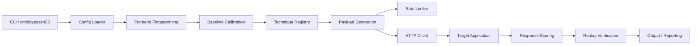
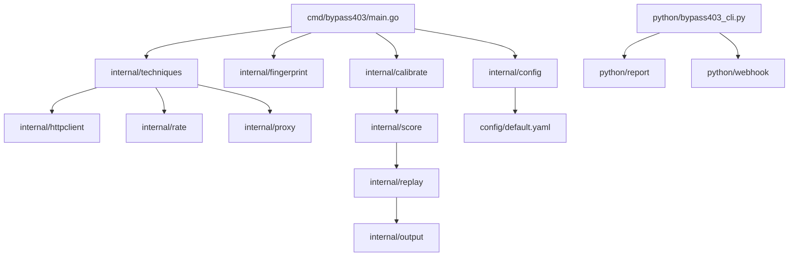
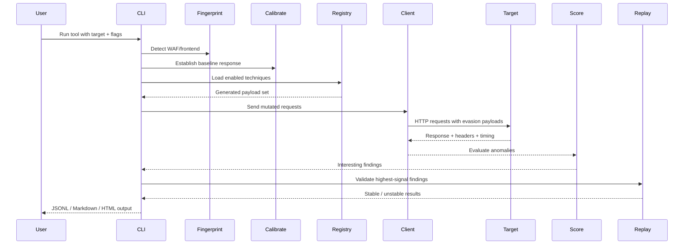

<p align="center">
  
</p>

<h1 align="center">YourWAFSucks</h1>
<p align="center"><strong>Authorized access-control assessment for web applications and WAFs</strong></p>

## Overview

YourWAFSucks is a Go-based assessment tool for identifying response differences that may indicate access-control weaknesses behind WAFs, reverse proxies, and frontend filters. It combines request variation, fingerprinting, baseline calibration, adaptive rate limiting, and scoring to highlight responses that differ from a target’s normal baseline.

Use it only on systems you own or have explicit authorization to assess.

## What the project does

The tool performs the following core actions:

- Detects likely frontend/WAF components such as Cloudflare, Akamai, AWS ALB, CloudFront, Nginx, Envoy, Apache, and IIS
- Establishes a baseline for the target before fuzzing
- Generates payload variants across multiple evasion classes
- Sends mutated requests with configurable headers, methods, paths, encoding, and raw HTTP edge cases
- Scores responses based on status, timing, size, and body differences from baseline
- Replays the most interesting results to reduce false positives
- Writes structured findings in JSONL and supporting report formats

## Key Features

- WAF and frontend fingerprinting
- Baseline calibration against a target
- Technique-driven payload generation
- Adaptive rate limiting with backoff behavior
- Proxy-aware HTTP transport
- Replay verification for suspicious results
- JSONL, Markdown, and HTML reporting hooks
- YAML-based configuration support
- CLI-driven execution and automation-friendly output

## Supported technique families

The project includes multiple payload classes, each mapped to a technique registry:

- `headers` – IP-trust header injection and trust bypass patterns
- `verbs` – HTTP method mutation and method confusion variants
- `endpaths` – suffix- and path-based evasion tricks
- `midpaths` – prefix and mid-path traversal variants
- `encoding` – double encoding, mixed case, and normalization variants
- `raw` – raw HTTP builders are present but are not dispatched by the current CLI
- `protocol` – the current transport does not implement the advertised HTTP-version variants
- `advanced` – host manipulation, cache-control bypasses, and deeper request variants
- `smt` – state-machine and session-state mutation patterns
- `unicode` – Unicode normalization and homograph-style edge cases

The CLI skips `raw` and `protocol` when selected because its current HTTP transport does not execute those payload types.

## Architecture

### High-level architecture



### Component structure



### Request workflow



## Repository layout

```text
.
├── cmd/
│   └── bypass403/
│       └── main.go
├── config/
│   ├── default.yaml
│   ├── frontend_signatures.json
│   ├── proxies.txt
│   └── waf_signatures.json
├── internal/
│   ├── calibrate/
│   ├── config/
│   ├── fingerprint/
│   ├── httpclient/
│   ├── output/
│   ├── proxy/
│   ├── rate/
│   ├── rawhttp/
│   ├── replay/
│   ├── score/
│   └── techniques/
├── payloads/
├── python/
│   ├── bypass403_cli.py
│   ├── report/
│   └── webhook/
├── tests/
│   ├── go/
│   └── python/
├── .gitignore
├── bypass403.sh
├── go.mod
├── go.sum
├── LICENSE
├── makefile
├── README.md
├── setup.sh
└── bypass403.exe
```

## Requirements

- Go 1.22+
- Optional Python 3 for report generation and webhook integration
- On Windows, use Git Bash or WSL with Go, GNU make, and optional Python 3
- Network access to the target application
- Explicit authorization before testing any environment

## Installation

### Clone the repository

```bash
git clone https://github.com/gl1tch0x1/YourWAFSucks.git
cd YourWAFSucks
```

### Interactive setup

Run the setup script to build the engine and launch the CLI:

```bash
./setup.sh
```

With no arguments, the CLI prompts for a target URL and confirmation that you are authorized to test it. Arguments passed to `setup.sh` are forwarded to `bypass403.sh`.

### Update an existing checkout

From a clean `main` checkout, run:

```bash
./update.sh
```

The updater fetches `origin/main`, builds that revision in a temporary directory, then fast-forwards the checkout and installs the verified Go binary. It refuses to overwrite tracked local changes or diverged history. Use `./update.sh --check` to see whether an update is available without applying it. On Windows, run it from Git Bash or WSL with Git and Go installed; GNU Make is not required by the updater.

### Build the binary

```bash
go mod download
go mod tidy
make build
```

This produces the Go binary under `bin/bypass403-go`.

### Alternative manual build

```bash
go build -ldflags "-s -w" -o bin/bypass403-go ./cmd/bypass403
```

## Quick start

```bash
./bypass403.sh -u https://target.example.com -k all -j 20 -v
```

With output file:

```bash
./bypass403.sh -u https://target.example.com -k headers,endpaths,encoding -o findings.jsonl
```

### Common CLI flags

```bash
-u, --url, --target       Target URL
-k, --techniques          Technique set or all
-j, --jobs                Worker count
-H, --header              Custom header (repeatable)
-b, --cookie              Cookie header
-x, --proxy               HTTP proxy URL
-o, --output              JSONL output path
--rate-limit              Requests per second
--timeout                 Request timeout (for example, 10s)
--retries                 Maximum request retries
--max-requests             Maximum HTTP attempts per target
--max-duration             Maximum scan duration (for example, 1h)
--allow-host               Exact allowed hostname (repeatable; does not include subdomains)
-ms, --match-status        Display responses with selected status codes (comma-separated)
-n, --dry-run              Print planned requests without sending them
-q, --quiet                Quiet mode
-v, --verbose              Verbose logging
--no-retest                Skip replay verification
--version                  Show version
```

## Configuration

The project ships with a YAML configuration file and supports overriding values through CLI flags.

```yaml
general:
  timeout: 10s
  workers: 20
  rate_limit: 100
  quiet: false
  verbose: false

techniques:
  enabled:
    - headers
    - verbs
    - endpaths
    - midpaths
    - encoding
    - advanced
    - smt
    - unicode
```

Configuration values are defined in `config/default.yaml` and interpreted by the configuration loader in `internal/config/config.go`.
The default safety limits are 10,000 HTTP attempts per target and a one-hour maximum duration. `--max-requests` and `--max-duration` can lower or raise these limits for a run. When one or more `--allow-host` values are supplied, the target and every followed redirect must match one of those hostnames exactly.

## How the tool works

1. A target is loaded and scanned for basic WAF/frontend signatures.
2. A baseline request is established to understand the normal shape of the application’s response.
3. Registered bypass techniques are generated and prioritized based on the detected frontend.
4. A rate-limited worker pool sends mutation requests to the target.
5. Each response is scored and compared with the baseline.
6. High-signal findings are replayed to confirm they are not false positives.
7. Results are written to log, JSONL, Markdown, or HTML output.

## Reporting and output

The Go engine emits structured JSONL output, and the Python helper layer can generate markdown and HTML summaries as well as webhook notifications.
Each finding record includes the target, tool version, and UTC scan timestamp alongside response and replay details. Cookies and global custom headers are not written; URL credentials and common secret query parameters are redacted.

Example JSONL record:

```json
{
  "method": "GET",
  "url": "https://target.example.com/admin",
  "technique": "headers",
  "status": 200,
  "score": 95,
  "reason": "status differs from baseline",
  "replay_count": 2
}
```

## Example usage

### Basic run

```bash
./bypass403.sh -u https://example.com/admin -k all
```

### Run with a proxy

```bash
./bypass403.sh -u https://example.com/admin -x http://127.0.0.1:8080 -k headers,endpaths
```

### Custom headers and cookie

```bash
./bypass403.sh -u https://example.com/admin \
  -H 'X-Forwarded-For: 127.0.0.1' \
  -H 'X-Real-IP: 127.0.0.1' \
  -b 'session=abc123'
```

### Generate report artifacts

```bash
python3 python/bypass403_cli.py \
  --go-binary ./bin/bypass403-go \
  -u https://example.com/admin \
  --md report.md \
  --html report.html
```

## Legal Disclaimer

This project is intended solely for authorized security testing, defensive research, and legitimate application validation in environments where explicit permission has been granted.

The maintainers are not responsible for misuse, unauthorized testing, or any unlawful activity performed with this software. Users are responsible for ensuring they comply with all applicable laws, contractual obligations, and organizational policies before using this tool against any target.

If you do not have written authorization to test a system, do not use this project against it.

## Contributing

Contributions are welcome. To contribute:

1. Fork the repository.
2. Create a feature branch:
   ```bash
   git checkout -b feature/your-change
   ```
3. Make your changes and keep the codebase consistent with the existing structure.
4. Run the relevant validation commands:
   ```bash
   go test ./...
   ```
5. Submit a pull request with a clear description of the changes and the reasoning behind them.

Please keep contributions focused, well-documented, and aligned with the project’s goal of responsible security research and testing.

## License

This project is licensed under the MIT License. See `LICENSE` for details.

## Security note

This project intentionally explores request mutation, access-control bypass logic, and WAF evasion techniques. It is best used in a controlled testing environment with appropriate safeguards, logging, and scope boundaries.

## Author

The project is maintained under the repository owner and contributors for the `YourWAFSucks` project.
