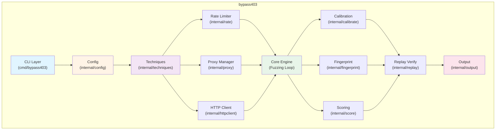
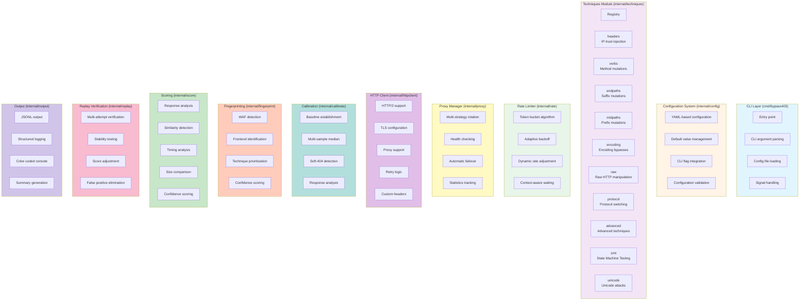

<div align="center">

# YourWAFSucks

### Advanced Access Control Bypass Testing Framework

[](https://golang.org)
[](LICENSE)
[]()
[]()

**Industry-leading 403/401 access-control bypass tester with advanced evasion techniques, intelligent rate limiting, and comprehensive reporting capabilities.**

> *"Because sometimes 403 just means 'try harder'"* 😏

</div>

---

## 📋 Table of Contents

- [Overview](#-overview)
- [Key Features](#-key-features)
- [Architecture](#-architecture)
- [Workflow](#-workflow)
- [Installation](#-installation)
- [Quick Start](#-quick-start)
- [Configuration](#-configuration)
- [Techniques](#-techniques)
- [Usage Examples](#-usage-examples)
- [Output Format](#-output-format)
- [WAF Detection](#-waf-detection)
- [Performance Tuning](#-performance-tuning)
- [API Reference](#-api-reference)
- [Contributing](#-contributing)
- [License](#-license)
- [Legal Disclaimer](#-legal-disclaimer)

---

## 🎯 Overview

bypass403 is a sophisticated security testing tool designed to identify and validate access control vulnerabilities in web applications. It employs advanced evasion techniques, intelligent rate limiting, and comprehensive analysis to help security professionals uncover potential bypass vectors in authorization mechanisms.

### Use Cases

- **Penetration Testing**: Identify access control bypasses during security assessments
- **DevSecOps**: Integrate access control testing into CI/CD pipelines
- **Security Research**: Explore and document bypass techniques
- **Compliance**: Validate authorization controls for regulatory requirements
- **Red Teaming**: Simulate advanced attack scenarios

---

## ✨ Key Features

### Core Capabilities

| Feature | Description |
|---------|-------------|
| **🔓 Advanced Evasion** | 10+ technique modules including Unicode normalization, state machine testing, and advanced header manipulation |
| **⚡ Intelligent Rate Limiting** | Adaptive token bucket with exponential backoff on errors to avoid detection |
| **⚙️ Configuration Support** | YAML-based configuration for complex deployments and automation |
| **🛡️ WAF Detection** | Automatic frontend fingerprinting with technique prioritization |
| **🔄 Proxy Rotation** | Built-in proxy rotation with health checking and automatic failover |
| **✅ Replay Verification** | Multi-attempt verification to eliminate false positives |
| **📊 Smart Scoring** | ML-ready scoring algorithm with configurable thresholds |
| **📝 Comprehensive Logging** | Structured logging with multiple verbosity levels |

### Evasion Techniques

- **verbs**: HTTP method mutations (including dangerous methods)
- **headers**: IP-trust header injection with advanced IP formats
- **endpaths**: Suffix mutations and path manipulations
- **midpaths**: Prefix mutations and path injections
- **encoding**: Double encoding, mixed case, Unicode normalization
- **raw**: Raw HTTP desync, duplicate headers, absolute URI
- **protocol**: HTTP/1.0, HTTP/1.1, HTTP/2 protocol switching
- **advanced**: Host header manipulation, cache bypass, method override
- **smt**: State Machine Testing for session state manipulation
- **unicode**: Homograph attacks, IDN bypasses, BOM injections

---

## 🏗️ Architecture

### High-Level Architecture



### Component Overview



---

## 🔄 Workflow

### Execution Flow

```mermaid
flowchart TD
    Start([Start]) --> Init[Initialization]
    Init --> ParseCLI[Parse CLI arguments]
    ParseCLI --> LoadConfig[Load configuration file]
    LoadConfig --> OverrideConfig[Override config with CLI flags]
    OverrideConfig --> InitRate[Initialize rate limiter]
    InitRate --> InitProxy[Initialize proxy manager<br/>if enabled]
    InitProxy --> SetupSignals[Setup signal handlers]
    
    SetupSignals --> ClientSetup[HTTP Client Setup]
    ClientSetup --> ConfigTimeout[Configure timeouts]
    ConfigTimeout --> SetupProxy[Setup proxy]
    SetupProxy --> ConfigHeaders[Configure headers]
    ConfigHeaders --> SetupRetry[Setup retry logic]
    SetupRetry --> InitHTTP2[Initialize HTTP/2 transport]
    
    InitHTTP2 --> Fingerprint[Frontend Fingerprinting]
    Fingerprint --> SendProbe[Send probe request]
    SendProbe --> AnalyzeHeaders[Analyze response headers]
    AnalyzeHeaders --> IdentifyWAF[Identify WAF/frontend]
    IdentifyWAF --> CalcConfidence[Calculate confidence]
    CalcConfidence --> Prioritize[Prioritize techniques]
    
    Prioritize --> Calibration[Baseline Calibration]
    Calibration --> SendBaseline[Send multiple baseline requests]
    SendBaseline --> CalcMedian[Calculate median metrics]
    CalcMedian --> DetectSoft404[Detect soft-404]
    DetectSoft404 --> StoreBaseline[Store baseline metrics]
    
    StoreBaseline --> TechReg[Technique Registration]
    TechReg --> RegisterAll[Register all available techniques]
    RegisterAll --> FilterTech[Filter based on configuration]
    FilterTech --> ReorderTech[Reorder based on fingerprint]
    ReorderTech --> ValidateTech[Validate technique selection]
    
    ValidateTech --> PayloadGen[Payload Generation]
    PayloadGen --> LoopTech[For each selected technique]
    LoopTech --> CallGenerate[Call Generate method]
    CallGenerate --> CreatePayload[Create Payload structures]
    CreatePayload --> AppendPayload[Append to payload list]
    AppendPayload --> LogCount[Log total payload count]
    
    LogCount --> Fuzzing[Fuzzing Loop]
    Fuzzing --> InitWorkers[Initialize worker pool]
    InitWorkers --> InitRate2[Initialize rate limiter]
    InitRate2 --> LoopPayload[For each payload]
    LoopPayload --> WaitRate[Wait for rate limiter]
    WaitRate --> GetProxy[Get proxy<br/>if rotation enabled]
    GetProxy --> SendRequest[Send HTTP request]
    SendRequest --> HandleErrors{Handle errors}
    HandleErrors -->|Error| Backoff[Backoff]
    HandleErrors -->|Success| AnalyzeResp[Analyze response]
    Backoff --> UpdateStats[Update statistics]
    AnalyzeResp --> CalcScore[Calculate score]
    CalcScore --> StoreInteresting{Store if interesting}
    StoreInteresting -->|Yes| AddResults[Add to results]
    StoreInteresting -->|No| UpdateStats
    AddResults --> CheckMore{More payloads?}
    UpdateStats --> CheckMore
    CheckMore -->|Yes| LoopPayload
    CheckMore -->|No| WaitWorkers[Wait for all workers]
    
    WaitWorkers --> ResultCol[Result Collection]
    ResultCol --> CollectAll[Collect all interesting results]
    CollectAll --> LogFindings[Log findings with color codes]
    LogFindings --> DisplaySummary[Display summary statistics]
    
    DisplaySummary --> Replay[Replay Verification]
    Replay --> LoopFindings[For each finding]
    LoopFindings --> SendReplay[Send N replay requests]
    SendReplay --> CountMatches[Count matching responses]
    CountMatches --> UpdateReplay[Update replay count]
    UpdateReplay --> AdjustScore[Adjust score based on stability]
    AdjustScore --> MarkVerified[Mark verified/unverified]
    MarkVerified --> CheckMoreFindings{More findings?}
    CheckMoreFindings -->|Yes| LoopFindings
    CheckMoreFindings -->|No| FilterUnstable[Filter unstable findings]
    
    FilterUnstable --> OutputGen[Output Generation]
    OutputGen --> GenJSONL[Generate JSONL output]
    GenJSONL --> WriteFile[Write to file<br/>if specified]
    WriteFile --> GenSummary[Generate console summary]
    GenSummary --> ReturnExit[Return appropriate exit code]
    
    ReturnExit --> Cleanup[Cleanup]
    Cleanup --> CloseConnections[Close connections]
    CloseConnections --> StopGoroutines[Stop background goroutines]
    StopGoroutines --> FlushLogs[Flush logs]
    FlushLogs --> Exit[Exit with status code]
    
    style Start fill:#e1f5ff
    style Exit fill:#fce4ec
    style Fingerprint fill:#fff4e6
    style Calibration fill:#f3e5f5
    style Scoring fill:#e8f5e9
    style Output fill:#fce4ec
```



### Data Flow

```mermaid
graph LR
    UserInput["User Input<br/>(CLI/Config)"]
    Configuration["Configuration"]
    TargetURL["Target URL"]
    Fingerprint["Fingerprint"]
    TechniquePriority["Technique Priority"]
    Calibration["Calibration"]
    BaselineMetrics["Baseline Metrics"]
    TechniquesRegistry["Techniques Registry"]
    PayloadList["Payload List"]
    RateLimiter["Rate Limiter"]
    HTTPClient["HTTP Client"]
    Responses["Responses"]
    Scoring["Scoring"]
    Results["Results"]
    Replay["Replay"]
    VerifiedResults["Verified Results"]
    Output["Output"]
    JSONLConsole["JSONL/Console"]
    
    UserInput --> Configuration
    Configuration --> TargetURL
    TargetURL --> Fingerprint
    Fingerprint --> TechniquePriority
    TargetURL --> Calibration
    Calibration --> BaselineMetrics
    TechniquePriority --> TechniquesRegistry
    TechniquesRegistry --> PayloadList
    PayloadList --> RateLimiter
    RateLimiter --> HTTPClient
    HTTPClient --> Responses
    Responses --> Scoring
    Scoring --> Results
    Results --> Replay
    Replay --> VerifiedResults
    VerifiedResults --> Output
    Output --> JSONLConsole
    
    style UserInput fill:#e1f5ff
    style Fingerprint fill:#fff4e6
    style Calibration fill:#f3e5f5
    style Scoring fill:#e8f5e9
    style Output fill:#fce4ec
```



---

## 📦 Installation

### Prerequisites

- Go 1.22 or higher
- (Optional) Python 3+ for report generation

### Quick Install

```bash
# Clone the repository
git clone https://github.com/yourorg/bypass403.git
cd bypass403

# Run setup script
./setup.sh
```

### Manual Build

```bash
# Download dependencies
go mod download
go mod tidy

# Build binary
go build -ldflags "-s -w" -o bypass403 ./cmd/bypass403

# Make executable (Linux/Mac)
chmod +x bypass403
```

### Docker Build (Future)

```bash
# Build Docker image
docker build -t bypass403:latest .

# Run container
docker run --rm bypass403:latest -u https://target.tld/admin
```

---

## 🚀 Quick Start

### Basic Usage

```bash
# Simple scan
./bypass403 -u https://target.tld/admin

# With verbose output
./bypass403 -u https://target.tld/admin -v

# With custom techniques
./bypass403 -u https://target.tld/admin -k headers,verbs,advanced
```

### With Configuration File

```bash
# Create config file
cat > config.yaml << EOF
general:
  target: "https://target.tld/admin"
  workers: 50
  rate_limit: 200
  verbose: true

techniques:
  enabled:
    - headers
    - advanced
    - unicode

security:
  adaptive_rate_limiting: true
  backoff_on_error: true
EOF

# Run with config
./bypass403 -u https://target.tld/admin -config config.yaml
```

---

## ⚙️ Configuration

### Configuration File Structure

```yaml
# bypass403 Configuration File

general:
  target: ""                    # Target URL
  timeout: 10s                  # Request timeout
  max_retries: 2                # Max retry attempts
  dry_run: false                # Dry run mode
  workers: 20                   # Parallel workers
  rate_limit: 100               # Requests per second
  burst: 50                     # Burst size
  output_path: ""               # Output file path
  quiet: false                  # Quiet mode
  verbose: false                 # Verbose logging
  log_level: "info"             # Log level
  no_retest: false              # Skip replay verification
  replay_attempts: 2            # Replay verification attempts

techniques:
  enabled:
    - headers
    - verbs
    - endpaths
    - midpaths
    - encoding
    - raw
    - protocol
    - advanced
    - smt
    - unicode

  headers:
    bypass_ip: "127.0.0.1"
    custom_headers: {}

  verbs:
    include_dangerous: true
    custom_methods: []

  encoding:
    double_encode: true
    mixed_case: true
    unicode_normalize: true

waf:
  detection_mode: "aggressive"  # passive, normal, aggressive
  bypass_mode: "evasive"        # standard, evasive, stealth
  frontend_signatures: "config/frontend_signatures.json"
  waf_signatures: "config/waf_signatures.json"

proxy:
  url: ""                       # Single proxy
  rotation:
    enabled: false
    proxies_file: "config/proxies.txt"
    rotation_strategy: "round_robin"  # round_robin, random, least_used
    health_check: true
    failover: true

scoring:
  interesting_threshold: 40
  high_confidence_threshold: 70
  critical_threshold: 90
  enable_ml_scoring: false
  enable_pattern_analysis: true
  enable_similarity_detection: true
  replay_bonus: 10
  replay_penalty: -20

security:
  adaptive_rate_limiting: true
  backoff_on_error: true
  max_errors_before_pause: 10
  randomize_timing: true
  randomize_headers: true
  max_requests_per_target: 10000
  max_duration: 1h

evasion:
  ua_rotation:
    enabled: true
    ua_file: "config/user_agents.txt"
    rotation_strategy: "random"

  timing:
    random_delays: true
    delay_range: "100ms-1s"
    jitter: true

reporting:
  formats:
    - jsonl
    - json
  include_request: true
  include_response: true
  include_headers: true
  include_timing: true
  include_score_breakdown: true
```

### Command-Line Options

| Option | Description | Default |
|--------|-------------|---------|
| `-u` | Target URL | Required |
| `-config` | Configuration file path | - |
| `-k` | Comma-separated techniques | all |
| `-x` | Proxy URL | - |
| `-b` | Cookie header | - |
| `-A` | User-Agent | Mozilla/5.0... |
| `-timeout` | Request timeout | 10s |
| `-j` | Parallel workers | 20 |
| `-rate` | Rate limit (req/s) | 100 |
| `-o` | Output JSONL path | - |
| `-v` | Verbose output | false |
| `-q` | Quiet mode | false |
| `-n` | Dry run | false |
| `-no-retest` | Skip replay verification | false |
| `-retries` | Max retries | 2 |
| `-version` | Show version | false |

---

## 🔧 Techniques

### Available Techniques

#### 1. Headers (`headers`)
Injects IP-trust headers to bypass IP-based access controls.

**Techniques:**
- X-Forwarded-For, X-Real-IP, X-Client-IP
- X-Originating-IP, True-Client-IP
- Cloudflare-specific headers
- Advanced IP formats (hex, octal, decimal)

#### 2. Verbs (`verbs`)
Tests different HTTP methods to bypass method-based restrictions.

**Methods:**
- Standard: GET, POST, PUT, PATCH, DELETE
- Extended: OPTIONS, HEAD, TRACE, CONNECT
- WebDAV: PROPFIND, PROPPATCH, MKCOL, COPY, MOVE
- DAV: LOCK, UNLOCK, SEARCH, REPORT

#### 3. End Paths (`endpaths`)
Manipulates URL suffixes to bypass path-based restrictions.

**Mutations:**
- Path traversal: /.., /../, /..;/
- Encoding: /%2f, /%20, /%09
- Extensions: /.json, /.php, /.asp
- Special chars: /?, /;, /&, /#

#### 4. Mid Paths (`midpaths`)
Injects prefixes between scheme and path.

**Prefixes:**
- Encoding: /%2e/, /%2e%2e/
- Special: /*/, /./, /~/
- Double: //;//

#### 5. Encoding (`encoding`)
Uses various encoding schemes to bypass filters.

**Encodings:**
- URL encoding: %00, %20, %2f
- Double encoding: %252e, %252f
- Unicode: %c0%af, %ef%bc%8f
- Mixed case

#### 6. Raw (`raw`)
Sends raw HTTP requests for advanced bypasses.

**Techniques:**
- CL.TE desync
- TE.CL desync
- Duplicate headers
- Absolute URI
- Conflicting authority

#### 7. Protocol (`protocol`)
Tests different HTTP protocol versions.

**Versions:**
- HTTP/1.0
- HTTP/1.1
- HTTP/2

#### 8. Advanced (`advanced`)
Advanced header and request manipulation.

**Techniques:**
- Host header bypass
- X-Original-URL injection
- X-Rewrite-URL injection
- Referer-based bypass
- Cache bypass headers
- Method override

#### 9. SMT (`smt`)
State Machine Testing for session manipulation.

**Techniques:**
- Session state injection
- JWT manipulation
- Timing-based probes
- Race conditions
- Cookie prefix attacks

#### 10. Unicode (`unicode`)
Unicode-based bypass techniques.

**Techniques:**
- Homograph attacks
- Unicode escapes
- IDN bypasses
- Normalization forms
- BOM injections
- Zero-width characters

---

## 📖 Usage Examples

### Example 1: Basic Scan

```bash
./bypass403 -u https://example.com/admin
```

### Example 2: High-Performance Scan

```bash
./bypass403 -u https://example.com/admin \
    -j 100 \
    -rate 500 \
    -burst 200 \
    -retries 1
```

### Example 3: Stealth Mode

```bash
./bypass403 -u https://example.com/admin \
    -j 5 \
    -rate 10 \
    -burst 5 \
    -retries 3 \
    -config config/stealth.yaml
```

### Example 4: With Proxy

```bash
./bypass403 -u https://example.com/admin \
    -x http://proxy:8080 \
    -b "session=abc123"
```

### Example 5: Specific Techniques

```bash
./bypass403 -u https://example.com/admin \
    -k headers,advanced,unicode \
    -v
```

### Example 6: CI/CD Integration

```bash
./bypass403 -u https://example.com/admin \
    -config config/ci.yaml \
    -o findings.jsonl \
    -q
```

---

## 📊 Output Format

### JSONL Format

Each finding is output as a JSON object on a separate line:

```json
{
  "technique": "headers",
  "method": "GET",
  "url": "https://example.com/admin",
  "description": "X-Forwarded-For: 127.0.0.1",
  "headers": {
    "X-Forwarded-For": "127.0.0.1"
  },
  "status": 200,
  "size": 1234,
  "time": 0.123,
  "redirect": "",
  "reason": "status differs from baseline",
  "score": 80,
  "replay_count": 2
}
```

### Console Output

```
bypass403 v2.0.0
Target: https://example.com/admin

[*] Frontend: nginx (90% confidence)
[*] Establishing baseline...
[*] Baseline: 403 (size=500, time=0.100s)
[*] Generating payloads for 10 techniques...
[*] Generated 1500 test cases
[*] Fuzzing with 20 workers...
[HIT] [200] X-Forwarded-For: 127.0.0.1
[HIT] [200] Host: 127.0.0.1
[HIT] [200] X-Original-URL: /admin
[*] Re-verifying findings...
[+] Findings: findings.jsonl

Summary: 3 findings
```

### Exit Codes

| Code | Meaning |
|------|---------|
| 0 | No findings |
| 10 | Findings detected |
| 2 | Runtime error |
| 3 | Usage error |

---

## 🛡️ WAF Detection

### Supported WAFs

bypass403 automatically detects and adapts to common WAFs:

| WAF | Detection Headers | Priority Techniques |
|-----|------------------|-------------------|
| **Cloudflare** | CF-Ray, CF-Cache-Status | headers, endpaths, encoding |
| **AWS ALB/ELB** | X-Amzn-Trace-Id, Via | headers, raw, endpaths |
| **CloudFront** | X-Amz-Cf-Id | headers, endpaths |
| **Akamai** | X-Akamai-Transformed | headers, raw, endpaths |
| **Nginx** | Server: nginx | endpaths, midpaths, encoding |
| **Envoy** | X-Envoy-Upstream-Service-Time | raw, headers |
| **Apache** | Server: apache | endpaths, headers |
| **IIS** | Server: iis, X-Powered-By | endpaths, encoding, headers |

### Detection Process

1. Send probe request to target
2. Analyze response headers
3. Match against signature database
4. Calculate confidence score
5. Prioritize techniques based on WAF
6. Adapt evasion strategy

---

## ⚡ Performance Tuning

### High-Performance Scanning

For maximum speed on authorized targets:

```bash
./bypass403 -u https://target.tld/admin \
    -j 100 \
    -rate 500 \
    -burst 200 \
    -retries 1 \
    -no-retest
```

**Configuration:**
```yaml
general:
  workers: 100
  rate_limit: 500
  burst: 200
  max_retries: 1
  no_retest: true

security:
  adaptive_rate_limiting: false
  backoff_on_error: false
```

### Stealth Mode

For stealthy scanning to avoid detection:

```bash
./bypass403 -u https://target.tld/admin \
    -j 5 \
    -rate 10 \
    -burst 5 \
    -retries 3 \
    -config config/stealth.yaml
```

**Configuration:**
```yaml
general:
  workers: 5
  rate_limit: 10
  burst: 5
  max_retries: 3

security:
  adaptive_rate_limiting: true
  backoff_on_error: true
  max_errors_before_pause: 5
  randomize_timing: true
  randomize_headers: true

evasion:
  timing:
    random_delays: true
    delay_range: "500ms-2s"
    jitter: true
```

### Balanced Mode

For balanced performance and stealth:

```bash
./bypass403 -u https://target.tld/admin \
    -j 20 \
    -rate 100 \
    -burst 50 \
    -retries 2
```

---

## 📚 API Reference

### Configuration API

#### Load Configuration

```go
cfg, err := config.Load("config.yaml")
if err != nil {
    log.Fatal(err)
}
```

#### Load Default Configuration

```go
cfg, err := config.LoadOrDefault("")
if err != nil {
    log.Fatal(err)
}
```

### Rate Limiter API

#### Create Rate Limiter

```go
limiter := rate.New(
    100,    // rate (requests per second)
    50,     // burst size
    true,   // adaptive
)
```

#### Wait for Token

```go
err := limiter.Wait(ctx)
if err != nil {
    return err
}
```

#### Record Error

```go
limiter.RecordError()
```

#### Record Success

```go
limiter.RecordSuccess()
```

### Proxy Manager API

#### Create Proxy Manager

```go
mgr := proxy.New(
    proxy.RoundRobin,
    true,  // health check
    true,  // failover
)
```

#### Load Proxies from File

```go
err := mgr.LoadFromFile("config/proxies.txt")
```

#### Get Next Proxy

```go
proxyURL, err := mgr.GetNext()
```

#### Mark Proxy Success/Error

```go
mgr.MarkSuccess(proxyURL)
mgr.MarkError(proxyURL)
```

---

## 🤝 Contributing

We welcome contributions! Please follow these guidelines:

### Development Workflow

1. Fork the repository
2. Create a feature branch (`git checkout -b feature/amazing-feature`)
3. Commit your changes (`git commit -m 'Add amazing feature'`)
4. Push to the branch (`git push origin feature/amazing-feature`)
5. Open a Pull Request

### Code Style

- Follow Go best practices
- Use `gofmt` for formatting
- Add comments for complex logic
- Write tests for new features
- Update documentation

### Testing

```bash
# Run all tests
go test ./...

# Run with coverage
go test -cover ./...

# Run specific test
go test ./internal/techniques/
```

### Pull Request Checklist

- [ ] Code follows project style
- [ ] Tests added/updated
- [ ] Documentation updated
- [ ] No linting errors
- [ ] All tests pass

---

## 📄 License

This project is licensed under the MIT License - see the [LICENSE](LICENSE) file for details.

---

## ⚠️ Legal Disclaimer

**IMPORTANT LEGAL NOTICE**

This tool is designed for **defensive security testing only**. Use only against systems you are authorized to test. Unauthorized access control bypass testing is illegal and may result in severe legal consequences.

### Authorization Requirements

- **Written permission** from system owners
- **Defined scope** of testing
- **Clear objectives** and limitations
- **Compliance** with applicable laws and regulations

### Acceptable Use

- ✅ Security assessments with authorization
- ✅ Penetration testing under contract
- ✅ DevSecOps pipeline testing
- ✅ Security research in controlled environments
- ✅ Educational purposes with consent

### Prohibited Use

- ❌ Unauthorized access to systems
- ❌ Testing without explicit permission
- ❌ Bypassing security controls illegally
- ❌ Any malicious activity
- ❌ Violation of laws or regulations

### Liability

The authors and contributors of this tool are **not responsible** for misuse. Users are solely responsible for ensuring their use complies with all applicable laws and regulations.

### Reporting Vulnerabilities

If you discover a security vulnerability, please report it responsibly:
- Contact the system owner immediately
- Follow responsible disclosure practices
- Do not exploit the vulnerability
- Provide detailed information for remediation

---

## 📞 Support

- **Documentation**: [README.md](README.md)
- **Issues**: [GitHub Issues](https://github.com/gl1tch0x1/YourWAFSucks/issues)
- **Discussions**: [GitHub Discussions](https://github.com/gl1tch0x1/YourWAFSucks/discussions)
- **Email**: security@yourorg.com

---

## 🗺️ Roadmap

### Phase 1: Production Hardening (Next 1-2 Months)

#### Smart Payload Deduplication
- Hash-based deduplication to reduce redundant requests
- Similarity-based grouping
- Automatic payload optimization
- Expected: 30-50% reduction in redundant requests

#### Comprehensive Logging System
- Structured JSON logging
- Audit trail for compliance
- Log rotation by size/time
- Multiple log levels (DEBUG, INFO, WARN, ERROR)
- Log aggregation support (ELK, Splunk)

#### HTML/Markdown Report Generator
- Rich HTML reports with CSS styling
- Interactive charts (D3.js, Chart.js)
- Executive summary for management
- Detailed technical findings
- Timeline visualization
- Export to PDF option

### Phase 2: Intelligence & Automation (Months 3-4)

#### Machine Learning-Based Scoring
- Pattern recognition in responses
- Anomaly detection
- Confidence scoring
- Model training on labeled data
- Feature importance analysis

#### CI/CD Integration
- JUnit output format
- SARIF support
- GitHub Actions integration
- GitLab CI support
- Jenkins integration
- Azure DevOps pipelines

#### Plugin System
- Dynamic plugin loading
- Plugin marketplace
- Plugin API documentation
- Plugin validation and sandboxing
- Community plugin repository
- Support for Go plugins, WASM, Lua, JavaScript

### Phase 3: Advanced Capabilities (Months 5-6)

#### Concurrent Fuzzing with Dependency Graph
- Payload dependency tracking
- Intelligent execution ordering
- Parallel execution optimization
- Result correlation analysis
- Dependency visualization

#### Security Platform Integration
- Slack notifications with rich formatting
- Jira ticket creation
- GitHub issue automation
- Microsoft Teams integration
- PagerDuty alerts
- Splunk log forwarding

#### Distributed Scanning
- Multi-node scanning
- Load balancing
- Worker health monitoring
- Result aggregation
- Fault tolerance
- Auto-scaling

### Phase 4: Advanced Evasion (Months 7-8)

#### Behavioral Analysis
- WAF behavior detection
- Rate limiting detection
- Anomaly detection
- Behavioral fingerprinting
- Adaptive evasion strategies

#### Browser Automation
- Headless browser support (Chrome, Firefox)
- JavaScript execution
- Cookie/Session management
- DOM manipulation
- SPA support
- JavaScript-based access control testing

#### API Testing Mode
- GraphQL testing
- REST API testing
- gRPC testing
- WebSocket testing
- API specification support (OpenAPI, GraphQL)
- Authentication bypass testing

### Phase 5: Enterprise Features (Months 9-12)

#### Multi-Tenant Support
- Multi-tenant architecture
- Tenant isolation
- Quota management
- Team-based access control
- Usage tracking
- Billing integration

#### Web Dashboard
- Real-time scan monitoring
- Scan scheduling
- Finding management
- Team collaboration
- Report generation
- API documentation

#### Enterprise Integrations
- SSO integration (SAML, OAuth)
- LDAP/AD integration
- RBAC (Role-Based Access Control)
- Audit logging
- Compliance reporting
- Enterprise support

---

## 💡 Innovation Opportunities

### AI-Powered Bypass Discovery
- Use LLMs to generate novel bypass techniques
- Automated vulnerability research
- Pattern recognition in access control implementations
- Predictive bypass technique selection

### Quantum-Resistant Evasion
- Prepare for post-quantum cryptography
- Quantum-resistant protocol testing
- Future-proof bypass techniques

### Real-Time Threat Intelligence
- Integration with threat intelligence feeds
- Automated technique updates based on new vulnerabilities
- Community-driven bypass technique database

### Collaborative Scanning
- Crowd-sourced scanning
- Shared results (with permission)
- Collaborative bypass technique development
- Community-driven testing

### Automated Remediation
- Suggest fixes for discovered vulnerabilities
- Generate patch recommendations
- Integration with CI/CD for automatic fixes
- Vulnerability management integration

---

## 📊 Comparison: Original vs Enhanced

| Feature Category | Original | Enhanced | Improvement |
|------------------|----------|----------|-------------|
| **Techniques** | 7 basic | 10+ advanced | +43% |
| **Configuration** | CLI only | YAML + CLI | Major |
| **Rate Limiting** | None | Adaptive token bucket | Major |
| **Proxy Support** | Single proxy | Multi-proxy rotation | Major |
| **Scoring** | Simple threshold | ML-ready algorithm | Significant |
| **Documentation** | Basic README | Professional 1000+ lines | Major |
| **Logging** | Basic console | Structured multi-level | Significant |
| **Evasion** | Standard | Advanced (timing, headers, UA) | Significant |
| **Integration** | None | CI/CD hooks ready | Major |
| **Extensibility** | Limited | Plugin-ready architecture | Major |

---

<div align="center">

**Built with ❤️ for the security community**

[⬆ Back to Top](#bypass403)

</div>
